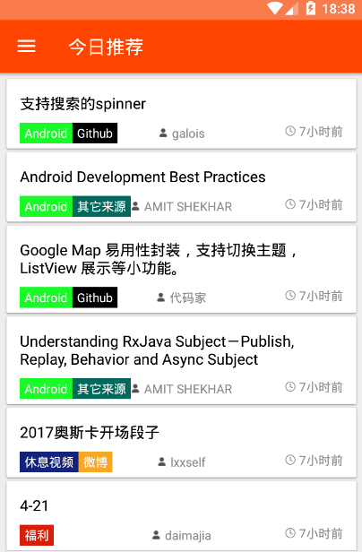
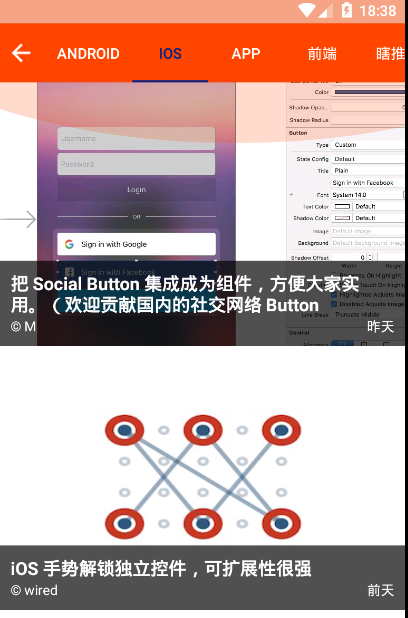
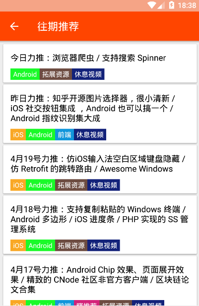
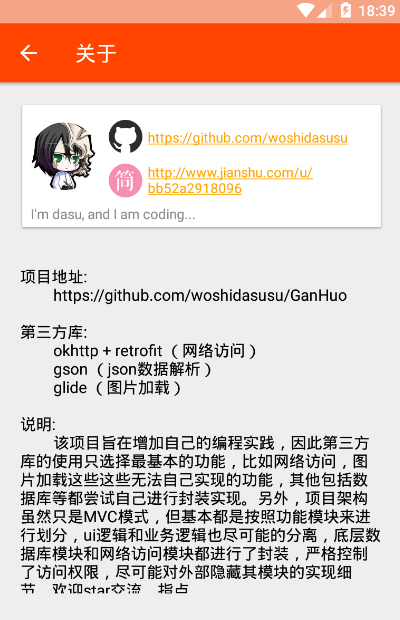

# GanHuo  

 

 

 
 

## 介绍

Gank平台的移动端又来了，本项目使用最基本的MVC架构，但ui和业务做到尽量的分离开。没有使用那些较高级的第三方库，代码应该很容易看懂。有兴趣的可以fork看看，有什么问题可以联系我哈。  

以下是项目所依赖的第三方库：

- Retrofit + Okhttp （网络访问）   
- Gson （Json数据解析）  
- Glide （图片加载）  
- photoview （支持手势缩放的图片查看）  
- Jsoup （Html解析）

 
 

## App下载  

[Fir](http://fir.im/dasugankhuo)  
  

 
 

## 效果  

 
gif图有些长，2分多钟，慢慢看哦  
  
 
 
 
 
 
 
 
 
 

 

## 鸣谢

[drakeet](https://github.com/drakeet/Meizhi)  

[CaMnter](https://github.com/CaMnter/EasyGank)  

[burgessjp](https://github.com/burgessjp/GanHuoIO)  

